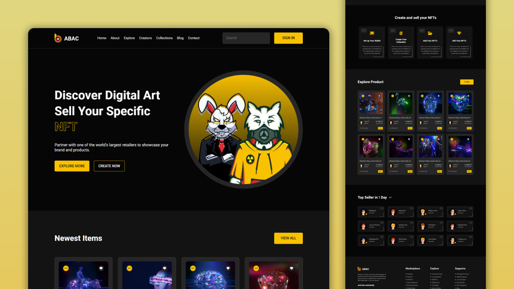
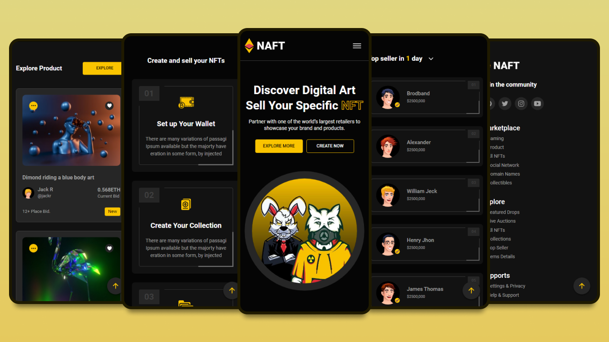

# NAFT - NFT Marketplace


[](https://twitter.com/intent/follow?screen_name=codewithsadee)
[](https://youtu.be/f_jQvRUaffo)

NAFT is a fully responsive nft marketplace website, responsive for all devices, built using HTML, CSS, and JavaScript.

## Demo




## Prerequisites

Before you begin, ensure you have met the following requirements:

* [Git](https://git-scm.com/downloads "Download Git") must be installed on your operating system.

## Installing NAFT

To install **NAFT**, follow these steps:

Linux and macOS:

```bash
sudo git clone https://github.com/codewithsadee/naft-nft_marketplace.git
```

Windows:

```bash
git clone https://github.com/codewithsadee/naft-nft_marketplace.git
```

## Contact

If you want to contact me you can reach me at [Twitter](https://www.twitter.com/codewithsadee).

## License

This project is **free to use** and does not contains any license.

